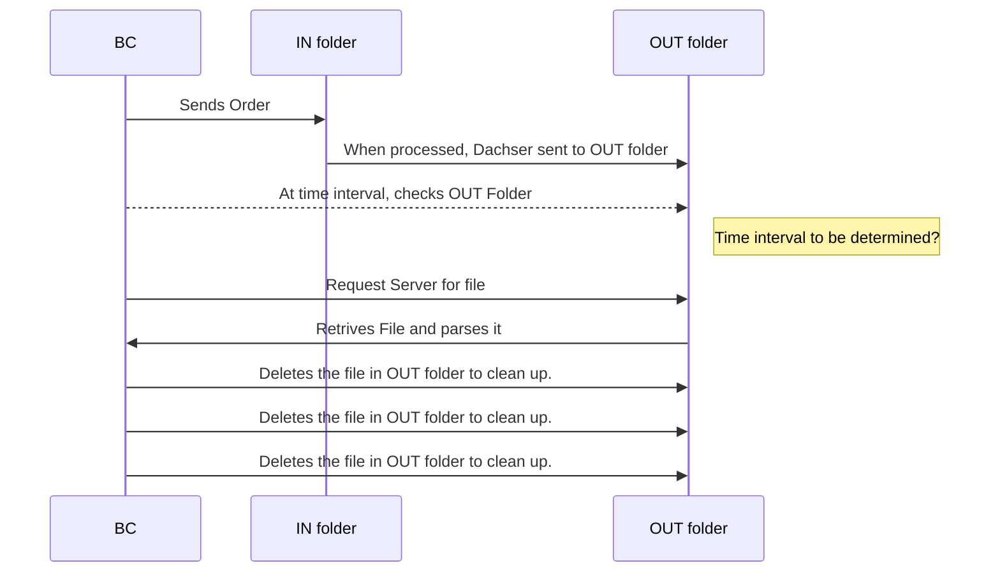

```mermaid
sequenceDiagram
    BC ->> IN folder: Sends Order
    IN folder->> OUT folder: When processed, Dachser sent to OUT folder
    BC -->> OUT folder: At time interval, checks OUT Folder
    Note right of OUT folder: Time interval to be determined?
    BC ->> OUT folder: Request Server for file
    OUT folder ->> BC: Retrives File and parses it
    BC ->> OUT folder: Deletes the file in OUT folder to clean up.
    BC ->> OUT folder: Deletes the file in OUT folder to clean up.
    BC ->> OUT folder: Deletes the file in OUT folder to clean up.
```

