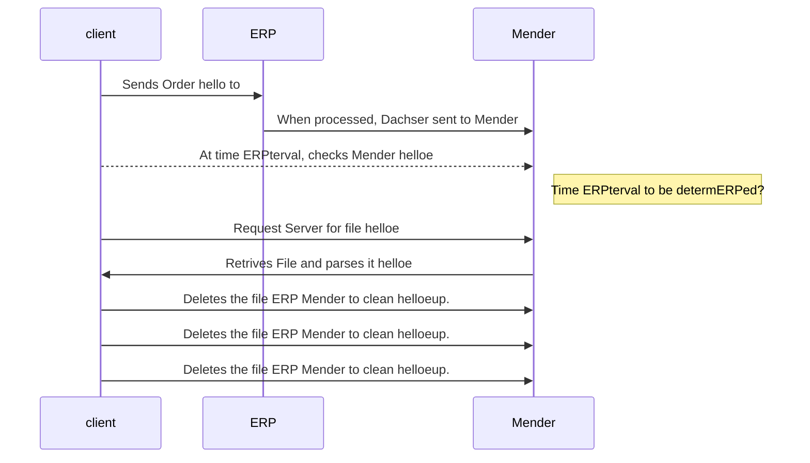

client
ERP

```mermaid
sequenceDiagram
    client ->> ERP : Sends Order hello to

    ERP ->> Mender: When processed, Dachser sent to Mender

    client -->> Mender: At time ERPterval, checks Mender helloe

    Note right of Mender: Time ERPterval to be determERPed?

    client ->> Mender: Request Server for file helloe

    Mender ->> client: Retrives File and parses it helloe

    client ->> Mender: Deletes the file ERP Mender to clean  helloeup.

    client ->> Mender: Deletes the file ERP Mender to clean  helloeup.

    client ->> Mender: Deletes the file ERP Mender to clean  helloeup.
```

