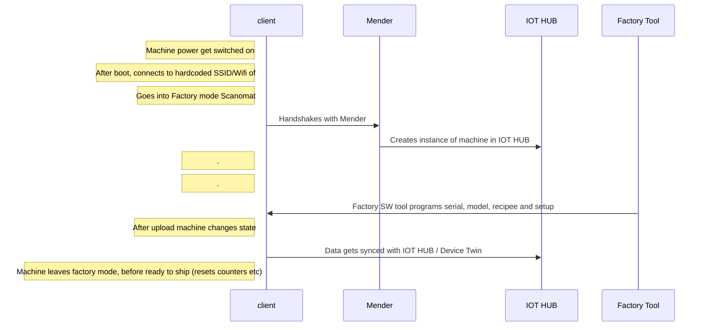

1. Machine power gets switched on
2. After boot, connects to hardcoded SSID of Scanomat 
3. Should probably go into some kind of factory mode
3. Handshakes with Mender 
4. Mender creates instance of machine in IOT HUB (integration)
5. Factory SW tool programs serial, model, recipee and setup
6. Data gets synced with IOT HUB / Device Twin
7. Machine leaves factory mode, before ready to ship (resets counters etc)

