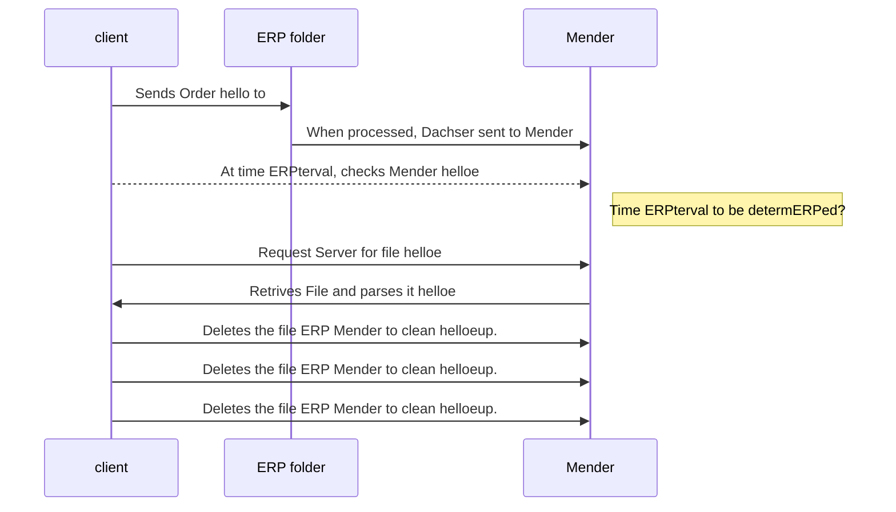

client
ERP

```mermaid
sequenceDiagram
    client ->> ERP folder: Sends Order hello to
    
    ERP folder->> Mender: When processed, Dachser sent to Mender
    
    client -->> Mender: At time ERPterval, checks Mender helloe
    
    Note right of Mender: Time ERPterval to be determERPed?
    
    client ->> Mender: Request Server for file helloe
    
    Mender ->> client: Retrives File and parses it helloe
    
    client ->> Mender: Deletes the file ERP Mender to clean  helloeup.
    
    client ->> Mender: Deletes the file ERP Mender to clean  helloeup.
    
    client ->> Mender: Deletes the file ERP Mender to clean  helloeup.
```

